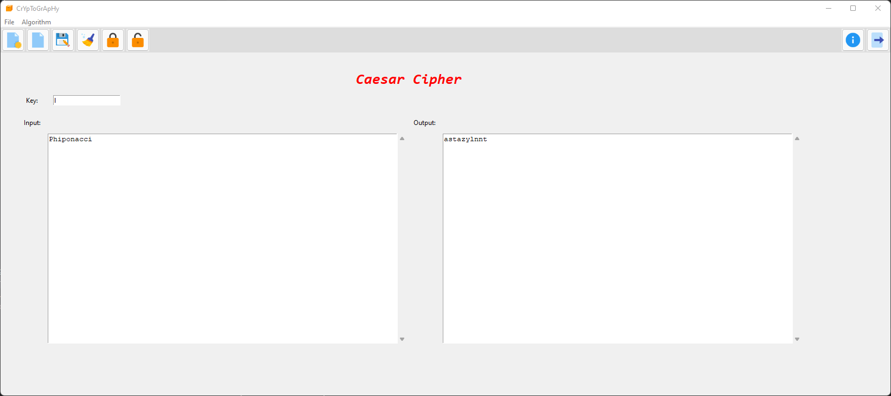

# How to run the application
1.  cd to/working/dir where main.py exists
2.  install requirements.txt using: `pip install -r requirements.txt`
3.  run `python main.py`

# Screen Shots

# Reach us on Fiverr & Upwork

# Donations

If you found ***crypto-app*** useful, please consider making a donation to support its ongoing development. Your contribution will help ensure that we can continue to provide updates and improvements to the app.

Developer paypal email: <leo.phibonacci@gmail.com>

Thank you for your support!
